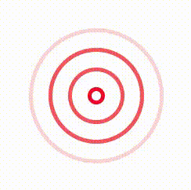

<div style="text-align:center">
    
</div>
    
# vue-pulser
A resposive SVG Pulser Loader for Vue 3

## Demo
A demo of the plugin is available <a href="https://g79nix.csb.app/">HERE</a>

## Getting Started
1. install it using NPM
```
npm i vue-pulser
```
2. Import it into your Vue file
```
import VuePulser from 'vue-pulser';
```
3. Register it (Globally or Locally)
```
components: {
    VuePulser
}
```
4. Add it to the template (With parameters)
```
<VuePulser size="250" width="2" color="red" circles="5" />
```

## Paramters
1. size: Size of whole pulser ---> Integer
2. width: Thickness if each circle ---> Integer
3. color: Color of circles (Color Names, HEX) ---> String 
4. circles: Number of Circles ---> Integer